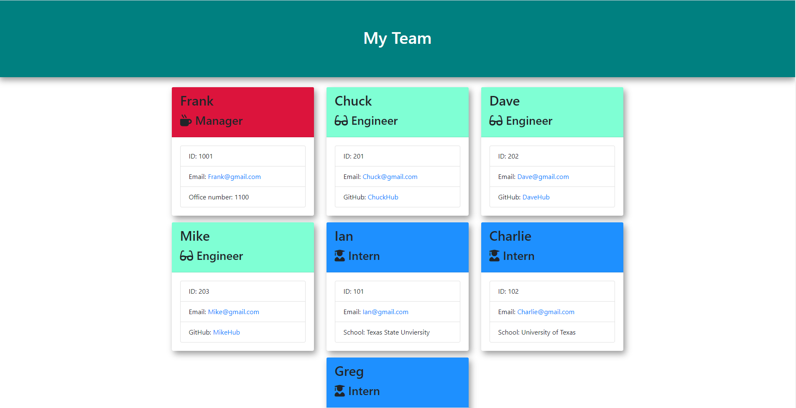
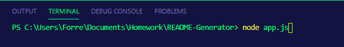

# Team-Generator
  
## Languages
&ensp;&ensp;&ensp;&ensp;
## Description
The Team Generator is a Node CLI that allows employers to create a static HTML page containing a list of all their employees. Each employee is created inside a card, which displays unique information and styling base on their role, e.g. "Manager", "Engineer", "Intern".

## Table of Contents
* [Installation](#Installation)
* [Usage](#Usage)
* [Contributing](#Contributing)
* [License](#License)
* [Languages](#Languages)
* [Contact](#Contact)

## Installation
To install The Team Generator create a clone of the repository on your local system.

## Usage
To use the Team Generator navigate to the root directory within your CLI and type "node app.js". Once the app is running follow the prompts to create your employees.

## License
MIT

## Contributing
If you would like to contribute to this project feel free to clone the repository and submit a pull request.

## Contact
Forrest Miller

[Click here to visit my website](http://www.forrestmillerdesign.com/)
